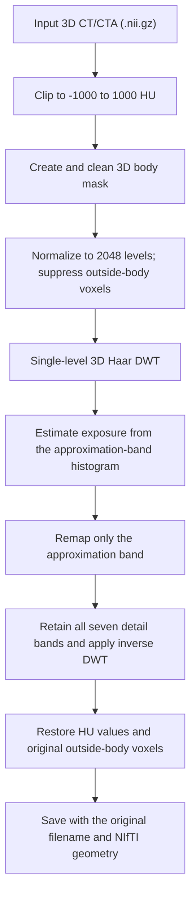

# Body-Aware 3D Wavelet Enhancement for CT and CTA

[](https://www.python.org/)
[](https://numpy.org/)
[](https://scipy.org/)
[](https://pywavelets.readthedocs.io/)
[](https://nipy.org/nibabel/)
[](https://pandas.pydata.org/)
[](https://matplotlib.org/)
[](LICENSE)

This repository provides a reproducible implementation of the method described
in:

> **Body-Aware 3D Wavelet Enhancement for Structure-Preserving CT Angiography Analysis**
> Muhammad Imran and Olamide Alabi, 2026.

The software enhances complete 3D CT or CT angiography volumes. It limits the
influence of background air, applies exposure-adaptive histogram remapping only
to the low-frequency approximation band of a single-level 3D Haar transform,
retains all seven detail bands, restores the result to the HU scale, and writes
the enhanced volume using the source NIfTI geometry and metadata.

## Contents

- [Scope](#scope)
- [Method pipeline](#method-pipeline)
- [Repository structure](#repository-structure)
- [Data preparation](#data-preparation)
- [Installation](#installation)
- [Run the enhancement](#run-the-enhancement)
- [Configuration](#configuration)
- [Outputs and verification](#outputs-and-verification)
- [Programmatic use](#programmatic-use)
- [Testing](#testing)
- [Recorded software environment](#recorded-software-environment)
- [Reproducing the paper workflow](#reproducing-the-paper-workflow)
- [Limitations and responsible use](#limitations-and-responsible-use)
- [Citation](#citation)

## Scope

This release implements the proposed enhancement transformation in manuscript
Eqs. (1)-(20), including:

- NIfTI loading and saving;
- 3D body-mask construction;
- HU clipping and intensity normalization;
- single-level 3D Haar decomposition;
- exposure-adaptive approximation-band remapping;
- inverse reconstruction and HU restoration;
- outside-body voxel restoration;
- single-case, directory-batch, and JSON-manifest execution;
- entropy reporting;
- output geometry checks; and
- optional matched orthogonal previews.

The program creates the enhanced volumes used as inputs to the paper's
downstream segmentation experiments. It does not redistribute AortaSeg24 or
BTCV data, patient images, labels, trained models, or model checkpoints.

## Method pipeline



The implementation follows this sequence:

1. **HU clipping.** Clip the input volume to `[-1000, 1000]` HU.
2. **Body masking.** Threshold at `-600` HU, apply 3D opening with a
   `3 x 3 x 3` element, apply 3D closing with a `5 x 5 x 5` element, fill
   holes, and retain the largest connected component.
3. **Normalization.** Map the clipped body volume to `2048` levels over
   `[0, 2047]`.
4. **Background suppression.** Set normalized outside-body voxels to zero only
   during enhancement.
5. **Even-size padding.** Add one edge-replicated voxel to each odd spatial
   dimension.
6. **3D wavelet decomposition.** Apply one 3D Haar level with periodization
   boundary handling.
7. **Approximation-band analysis.** Round the approximation coefficients,
   calculate the masked histogram range, exposure index, histogram clipping
   threshold, and exposure-dependent split point.
8. **Piecewise remapping.** Build lower- and upper-range cumulative mappings
   and modify only masked approximation coefficients.
9. **Structure retention.** Keep all seven high-frequency detail bands
   unchanged.
10. **Reconstruction.** Apply the inverse 3D transform, remove padding, clip
    to `[0, 2047]`, and map back to HU.
11. **Outside-body restoration.** Copy original outside-body values into the
    final volume.
12. **NIfTI output.** Save rounded `int16` values after a safety clip to
    `[-1024, 3071]`, while retaining the source affine, header, spacing,
    orientation, q-form, s-form, and filename.

## Repository structure

```text
body-aware-3d-wavelet-ct-enhancement/
├── README.md
├── LICENSE
├── CITATION.cff
├── pyproject.toml
├── requirements.txt
├── environment.yml
├── run_enhancement.sh
├── configs/
│   └── dataset_example.json
├── data/
│   ├── README.md
│   ├── input/
│   │   └── .gitkeep
│   └── output/
│       └── .gitkeep
├── src/
│   └── body_aware_wavelet/
│       ├── __init__.py
│       ├── cli.py
│       ├── config.py
│       ├── dataset.py
│       ├── enhancement.py
│       ├── io.py
│       ├── mask.py
│       ├── qc.py
│       └── runner.py
└── tests/
    ├── __init__.py
    └── test_pipeline.py
```

## Data preparation

### Obtain the datasets

This repository does not contain medical-image data. Researchers must obtain
the datasets independently and comply with their access and use conditions:

- [AortaSeg24 Grand Challenge](https://aortaseg24.grand-challenge.org/)
- [BTCV: Multi-Atlas Labeling Beyond the Cranial Vault](https://www.synapse.org/Synapse:syn3193805)

### Simplest directory layout

Place one or more compressed 3D NIfTI files directly in `data/input/`:

```text
data/
├── input/
│   ├── case_0001.nii.gz
│   ├── case_0002.nii.gz
│   └── case_0003.nii.gz
└── output/
```

The case prefix is not fixed. These are all valid:

```text
AortaSeg24_0001.nii.gz
AortaSeg24_0001_0000.nii.gz
img0001.nii.gz
case_0001.nii.gz
```

Directory mode reads every `.nii.gz` file directly inside the selected input
directory. It does not search subdirectories. Every output uses the exact
input filename.

### Recommended dataset-specific layout

The same runner can be used with separate dataset folders:

```text
datasets/
├── AortaSeg24/
│   ├── original/
│   │   ├── AortaSeg24_0001.nii.gz
│   │   ├── AortaSeg24_0002.nii.gz
│   │   └── ...
│   └── enhanced/                 # created automatically
└── BTCV/
    ├── original/
    │   ├── img0001.nii.gz
    │   ├── img0002.nii.gz
    │   └── ...
    └── enhanced/                 # created automatically
```

If your downloaded AortaSeg24 files use the nnU-Net channel suffix `_0000`,
keep that suffix. The output filename will remain unchanged.

### JSON-manifest layout

JSON mode accepts MONAI-style `training` and `test` lists:

```json
{
  "training": [
    {"image": "../data/input/AortaSeg24_0001.nii.gz"},
    {"image": "../data/input/AortaSeg24_0002.nii.gz"}
  ],
  "test": [
    {"image": "../data/input/AortaSeg24_0081.nii.gz"}
  ]
}
```

An entry may also be a direct string path. Relative paths are resolved from
the directory containing the JSON file. JSON outputs are written to
`<output-dir>/<split-name>/`, which prevents filename collisions across
splits.

## Installation

### Option 1: Conda

```bash
git clone https://github.com/iCARE-Lab/body-aware-3d-wavelet-ct-enhancement.git
cd body-aware-3d-wavelet-ct-enhancement
conda env create -f environment.yml
conda activate body-aware-wavelet-ct
```

The environment file installs this repository in editable mode and resolves
the pinned Python dependencies from `pyproject.toml`.

### Option 2: Existing Python 3.11 environment

```bash
python -m pip install -r requirements.txt
python -m pip install -e .
```

The original notebooks import `pywt`. Therefore, **PyWavelets is required**.
If all other packages are already installed, add it with:

```bash
python -m pip install PyWavelets==1.9.0
```

### Hardware

The enhancement algorithm is CPU-based. It does not require PyTorch, CUDA, a
GPU, or a trained model. Available RAM must be sufficient to hold the input
volume, mask, wavelet coefficients, and reconstructed volume.

## Run the enhancement

### Recommended: use the single shell runner

Make the runner executable once:

```bash
chmod +x run_enhancement.sh
```

Open `run_enhancement.sh` and edit only the **USER CONFIGURATION** section.
The main variables are:

```bash
MODE="directory"                   # single | directory | json
INPUT_PATH="/absolute/path/input"
OUTPUT_DIR="/absolute/path/output"
REPORT_DIR="/absolute/path/reports"
```

Then run:

```bash
./run_enhancement.sh
```

Values may also be provided without editing the file.

### One NIfTI volume

```bash
MODE=single \
INPUT_PATH=/absolute/path/case_0001.nii.gz \
OUTPUT_DIR=/absolute/path/enhanced \
./run_enhancement.sh
```

The result will be:

```text
/absolute/path/enhanced/case_0001.nii.gz
```

### A directory of NIfTI volumes

```bash
MODE=directory \
INPUT_PATH=/absolute/path/original \
OUTPUT_DIR=/absolute/path/enhanced \
EXPECTED_COUNT=100 \
./run_enhancement.sh
```

`EXPECTED_COUNT` is optional. A mismatch produces a warning without changing
the selected files.

### A JSON manifest

```bash
MODE=json \
DATASET_JSON=/absolute/path/dataset.json \
JSON_SPLITS=training,test \
OUTPUT_DIR=/absolute/path/enhanced \
./run_enhancement.sh
```

### Direct Python CLI

After `pip install -e .`, the same operations are available through the
console entry point:

```bash
body-aware-wavelet directory \
  --input-dir /absolute/path/original \
  --output-dir /absolute/path/enhanced \
  --report-dir /absolute/path/reports \
  --preview-count 1 \
  --overwrite
```

Run `body-aware-wavelet --help` or
`body-aware-wavelet directory --help` for all options.

## Configuration

The defaults reproduce the submitted method. Parameters can be edited in
`run_enhancement.sh` or supplied as environment variables.

| Shell variable | Default | Purpose |
|---|---:|---|
| `MODE` | `directory` | Select `single`, `directory`, or `json` input |
| `INPUT_PATH` | `data/input` | Single NIfTI file or input directory |
| `OUTPUT_DIR` | `data/output` | Enhanced NIfTI destination |
| `REPORT_DIR` | `runs/latest` | CSV, JSON, and preview destination |
| `DATASET_JSON` | `configs/dataset_example.json` | JSON manifest for JSON mode |
| `JSON_SPLITS` | `training,test` | Comma-separated JSON keys |
| `HU_MIN` | `-1000` | Lower HU clipping bound |
| `HU_MAX` | `1000` | Upper HU clipping bound |
| `LEVELS` | `2048` | Number of normalized intensity levels |
| `WAVELET` | `haar` | Wavelet used in the single-level 3D DWT |
| `BODY_THRESHOLD_HU` | `-600` | Preliminary body-mask threshold |
| `ENTROPY_BINS` | `256` | Histogram bins used for reported entropy |
| `EPS` | `1e-8` | Numerical protection for divisions |
| `SAVE_HU_MIN` | `-1024` | Safety clip before `int16` saving |
| `SAVE_HU_MAX` | `3071` | Safety clip before `int16` saving |
| `PRESERVE_OUTSIDE_MASK` | `true` | Restore original outside-body voxels |
| `OVERWRITE` | `true` | Replace an existing output with the same name |
| `EXPECTED_COUNT` | empty | Optional file-count check |
| `PREVIEW_COUNT` | `1` | Number of previews saved per processed split |
| `PYTHON_BIN` | `python` | Python executable used by the shell runner |

Changing the HU window, wavelet, number of levels, body threshold, or
outside-mask rule creates a method variant and will no longer reproduce the
paper's default transformation.

## Outputs and verification

For directory mode, a typical run produces:

```text
data/output/
├── case_0001.nii.gz
├── case_0002.nii.gz
└── ...

runs/latest/
├── case_results.csv
├── run_summary.json
└── previews/
    └── directory/
        └── case_0001_orthogonal_preview.png
```

The case-level report records:

- input and output paths;
- case filename;
- volume shape and voxel spacing;
- entropy before, after, and change;
- body-mask size and fraction;
- approximation-band limits `k` and `K`;
- exposure index `E`;
- histogram threshold `T`;
- split point `X`;
- processing time;
- output file size;
- affine, spacing, q-form, s-form, and shape checks; and
- any case-level exception.

The program continues after a case-level error, records that error, and exits
with a nonzero status after writing the report. Review `run_summary.json` and
confirm that:

```text
counts.error == 0
```

Also confirm that every successful case has:

```text
geometry_preserved == true
```

## Programmatic use

Input arrays must use internal `[z, y, x]` order:

```python
from body_aware_wavelet import EnhancementConfig, enhance_ct_volume_3d
from body_aware_wavelet.io import load_ct_nifti, save_ct_nifti

config = EnhancementConfig(
    hu_min=-1000,
    hu_max=1000,
    levels=2048,
    wavelet="haar",
    body_threshold_hu=-600,
    preserve_outside_mask=True,
)

volume_hu, spacing_zyx, reference = load_ct_nifti(
    "data/input/case_0001.nii.gz"
)
enhanced_hu, debug = enhance_ct_volume_3d(volume_hu, config)
save_ct_nifti(
    enhanced_hu,
    reference,
    "data/output/case_0001.nii.gz",
)

print(spacing_zyx)
print(debug["entropy_before"], debug["entropy_after"])
```

## Testing

The tests generate synthetic CT-like NIfTI volumes. No clinical or benchmark
data are required.

```bash
PYTHONPATH=src python -m unittest discover -s tests -v
```

The tests check:

- odd-dimension padding and reconstruction;
- output shape preservation;
- restoration of outside-body values;
- handling of a constant background volume;
- output filename preservation; and
- affine, spacing, q-form, and s-form preservation after NIfTI saving.

## Recorded software environment

The table below records the supplied environment. Only packages marked
**Core** are required by the enhancement runner. PyWavelets was added because
the notebook imports `pywt`.

| Icon | Category | Package or system | Version/status | Role |
|:---:|---|---|---:|---|
| 🐧 | System | glibc | 2.28 | Runtime |
| 🐍 | Python | CPython | 3.11.15 | **Core** |
| 📦 | Environment | Conda | 25.3.0 | Environment management |
| 🔢 | Scientific computing | NumPy | 2.4.6 | **Core** |
| 🧮 | Scientific computing | SciPy | 1.17.1 | **Core** |
| 🐼 | Data processing | pandas | 3.0.3 | **Core**, run reports |
| 📊 | Visualization | Matplotlib | 3.10.9 | **Core**, optional previews |
| 🌊 | Wavelets | PyWavelets | 1.9.0 | **Core**, 3D DWT/IDWT |
| 🧠 | Medical imaging | NiBabel | 5.4.2 | **Core**, NIfTI I/O |
| 🧬 | Image processing | scikit-image | 0.26.0 | Available; not required |
| 🖼️ | Image processing | Pillow | 12.2.0 | Pinned Matplotlib image backend |
| 👁️ | Computer vision | OpenCV | 4.13.0 | Available; not required |
| 🩻 | Medical imaging | SimpleITK | 2.5.5 | Available alternative; not active |
| 🔥 | Deep learning | PyTorch | 2.12.0+cu126 | Downstream work; not required |
| 📷 | Deep learning | TorchVision | 0.27.0+cu126 | Downstream work; not required |
| 🧩 | Medical AI | MONAI | 1.5.1 | Downstream work; not required |
| 📓 | Development | JupyterLab | 4.6.1 | Optional development interface |
| ⚡ | GPU support | PyTorch CUDA build | 12.6 | Not required for enhancement |
| 🚀 | GPU support | cuDNN | 9.10.2 | Not required for enhancement |

## Reproducing the paper workflow

To reproduce the proposed enhancement stage:

1. Obtain the original AortaSeg24 and BTCV NIfTI volumes from their authorized
   sources.
2. Keep the original filenames unchanged.
3. Run all 100 AortaSeg24 volumes with the manuscript defaults.
4. Run all 30 BTCV volumes with the same defaults.
5. Confirm zero case errors and successful geometry checks.
6. Preserve the generated `case_results.csv`, `run_summary.json`, and enhanced
   volumes as provenance records.
7. Use the enhanced volumes with the same labels, case splits, preprocessing,
   training settings, inference procedure, and evaluation code used for the
   matched original-volume experiments.

For a local AortaSeg24 directory:

```bash
MODE=directory \
INPUT_PATH=/data/AortaSeg24/original \
OUTPUT_DIR=/data/AortaSeg24/enhanced \
REPORT_DIR=/data/AortaSeg24/reports \
EXPECTED_COUNT=100 \
PREVIEW_COUNT=3 \
./run_enhancement.sh
```

For a local BTCV directory:

```bash
MODE=directory \
INPUT_PATH=/data/BTCV/original \
OUTPUT_DIR=/data/BTCV/enhanced \
REPORT_DIR=/data/BTCV/reports \
EXPECTED_COUNT=30 \
PREVIEW_COUNT=3 \
./run_enhancement.sh
```

The enhancement is deterministic for a fixed input file, software
environment, and parameter set. It has no learned weights and uses no random
sampling.

## Limitations and responsible use

- This is research software, not a clinical device.
- The method has not been validated for diagnosis, treatment selection, or
  unsupervised clinical use.
- Enhancement may not improve every patient, anatomy, scanner, acquisition
  protocol, or downstream model.
- Always inspect the original and enhanced scans together.
- Verify the output geometry report before pairing enhanced images with
  labels, segmentations, or measurements.
- Do not commit patient data, controlled datasets, credentials, or local
  absolute paths to GitHub.
- The repository does not grant rights to redistribute AortaSeg24, BTCV, or
  any other third-party dataset.

## Citation

The journal citation will be added after publication. Until then, cite the
manuscript and repository:

```text
Imran, M., and Alabi, O. (2026).
Body-Aware 3D Wavelet Enhancement for Structure-Preserving
CT Angiography Analysis. Manuscript submitted for publication.
https://github.com/iCARE-Lab/body-aware-3d-wavelet-ct-enhancement
```

GitHub can also read the repository's [`CITATION.cff`](CITATION.cff).

## License

The source code is released under the [MIT License](LICENSE). Dataset licenses
and access conditions remain governed by the original data providers.

## Contact

**Muhammad Imran**

Department of Data Science and Analytics, Kennesaw State University

Email: [mimran3@kennesaw.edu](mailto:mimran3@kennesaw.edu)
